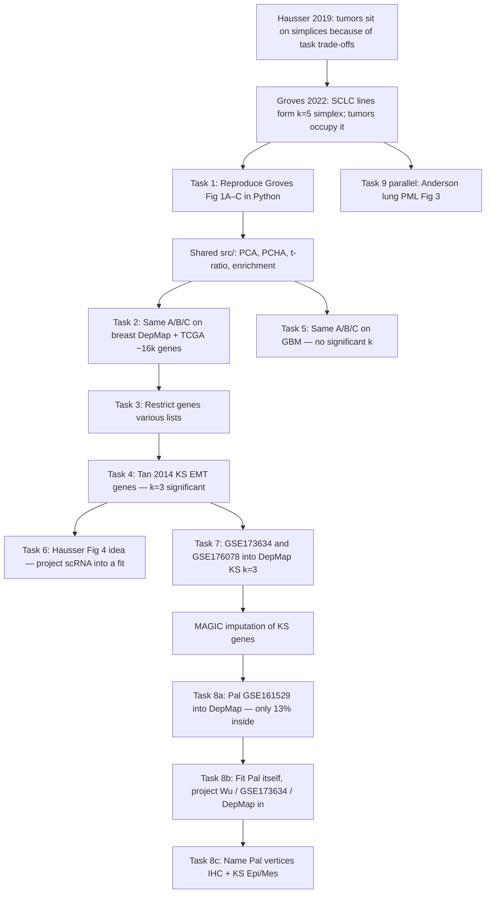
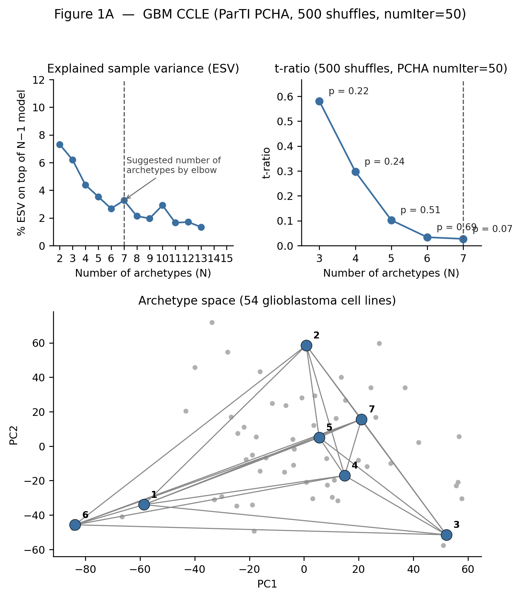
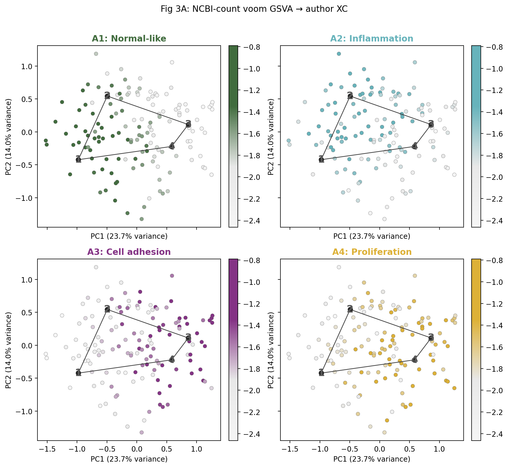

# Project 1 — learning walkthrough (from zero to Pal reverse)

**Who this is for:** you, rereading the last ~1.5 months without assuming any of the jargon stuck.  
**Repo root:** `Project_1/`. All commands below are from that root.  
**Date of this snapshot:** 21 Sep 2026.

If a word is in **bold** the first time, that is the definition. Later sections reuse it.

---

## Index

1. [How to use this file](#1-how-to-use-this-file)
2. [Flowchart of the whole project](#2-flowchart-of-the-whole-project)
3. [Primer — concepts from the ground up](#3-primer--concepts-from-the-ground-up)
4. [Task 1 — SCLC reproduction (Groves Figure 1A–C)](#4-task-1--sclc-reproduction-groves-figure-1ac)
5. [Bridge — a shared Python engine](#5-bridge--a-shared-python-engine)
6. [Task 2 — Breast, full transcriptome, DepMap + TCGA](#6-task-2--breast-full-transcriptome-depmap--tcga)
7. [Task 3 — Breast, other genelists](#7-task-3--breast-other-genelists)
8. [Task 4 — Breast KS genes + METABRIC](#8-task-4--breast-ks-genes--metabric)
9. [Task 5 — Glioblastoma (same A/B/C)](#9-task-5--glioblastoma-same-abc)
10. [Task 6 — Hausser drafts (Fig. 1d / Fig. 4 style)](#10-task-6--hausser-drafts-fig-1d--fig-4-style)
11. [Task 7 — Single cells into the DepMap KS triangle](#11-task-7--single-cells-into-the-depmap-ks-triangle)
12. [Task 8 — Pal (GSE161529) as guest, then as host](#12-task-8--pal-gse161529-as-guest-then-as-host)
13. [Task 9 — Anderson premalignant lung (parallel thread)](#13-task-9--anderson-premalignant-lung-parallel-thread)
14. [Where you are now — one story](#14-where-you-are-now--one-story)
15. [What to take ahead](#15-what-to-take-ahead)

Companion maps (how to *run*, not why): `README.md`, `Breast Cancer/docs/SCRIPTS.md`, `Breast Cancer/results/README.md`.

---

## 1. How to use this file

Read **§3** once. Then each task is the same skeleton:

| Letter | Meaning |
|---|---|
| **a** | Papers / data sources |
| **b** | What those papers claimed |
| **c** | Concepts (easy → hard), built only as needed |
| **d** | What *you* actually ran (scripts, settings) |
| **e** | Numbers and figures |
| **f** | What it means |
| **g** | What it can be taken ahead as |

Figures are the PNGs in the repo, linked from here. Open them while reading.

---

## 2. Flowchart of the whole project



**The scientific question that survived:**  
Should KS/EMT archetypes be **defined on cell lines** or **on tumors**? Do we get the same corners?

---

## 3. Primer — concepts from the ground up

You can skip a subsection if it already feels boring. Do not skip **simplex**, **barycentric**, **t-ratio**.

### 3.1 An expression matrix

A table:

- **rows = genes** (e.g. *CDH1*, *VIM*)
- **columns = samples** (cell lines, tumors, or single cells)
- **entry = how much that gene is expressed** in that sample

**Bulk RNA-seq:** one number per gene per *sample* (a whole tumor or a dish of cells). The number is a mixture of all cells in the sample.

**scRNA-seq:** one number per gene per *cell*. Many zeros (dropout): the gene was there but the count was 0 by chance.

**TPM / CPM / UMI:** different normalizations so samples with more total reads are comparable. DepMap files you used are already **log2(TPM+1)**. Do not log them again.

### 3.2 Why log?

Expression spans orders of magnitude. log2 makes “twice as much” a constant step. PCA on raw counts would be dominated by a few huge genes.

### 3.3 PCA (principal component analysis)

You have thousands of genes. Most of the *shape* of the cloud lives in a few directions.

**PCA** finds new axes (PC1, PC2, …) that are linear combinations of genes:

- PC1 = the direction of **most variance** among samples
- PC2 = next, perpendicular to PC1
- and so on

Each sample becomes a point `(PC1, PC2, …)`. Fitting a geometric shape on 2–12 PCs is possible; on 16,000 gene axes it is not.

In code, samples × genes goes in; scores (samples × PCs) come out:

```7:17:src/pca.py
def fit_pca(X, n_components, random_state=0):
    """Fit PCA on samples × features.
    ...
    """
    pca = PCA(n_components=n_components, svd_solver="full", random_state=random_state)
    scores = pca.fit_transform(np.asarray(X, dtype=float))
    return pca, scores
```

**Convention in this project:** first keep enough PCs to explain **≥ 50%** of variance (SCLC used 12 PCs like Groves, even though that was ~47%).

**Inverse PCA:** given a point in PC space, reconstruct an approximate gene vector. Used to move archetypes from PC space back to genes, then into a *new* PCA (Panel C / projections).

### 3.4 Convex hull and simplex

Imagine points on a table.

- **Convex hull:** the rubber band stretched around all points. Volume = area of that polygon (in 2-D).
- **Simplex:** the simplest polytope with `k` corners.  
  - `k=3` → triangle (lives in 2-D)  
  - `k=4` → tetrahedron (lives in 3-D)  
  - `k=5` → 4-D analogue  

A **k-vertex simplex always lives in (k−1) dimensions.** That is why PCHA is fit on the first **k−1 PCs**, not on all PCs.

### 3.5 Archetypes and PCHA

**Archetype** = a *corner* of the data cloud: an extreme expression program. Real samples are **mixtures** of corners, not clusters of one type.

**PCHA** (Principal Convex Hull Analysis) finds `k` points such that:

1. every sample is a mix of archetypes with weights **≥ 0 that sum to 1**;
2. with `delta=0`, each archetype is itself a mix of **real samples** (corners are not invented outside the data).

Those weights are **barycentric coordinates**. Example for a triangle: `(0.7, 0.2, 0.1)` means “mostly vertex 1.” If any weight is **negative**, the point is **outside** the triangle. That is how you compute “% inside.”

Library: `py_pcha`. Wrapper that matches MATLAB ParTI: many random starts, **keep the simplex with largest volume**:

```62:77:src/archetypes.py
def fit_pcha_best(pc_scores, k, n_init=50, delta=0.0, conv_crit=1e-6, maxiter=500):
    """Match ParTI: fit PCHA n_init times on the first (k-1) PCs, keep max volume."""
    scores = np.asarray(pc_scores, dtype=float)[:, : int(k) - 1]
    ...
            vol = simplex_volume(archetypes)
            ...
            if np.isfinite(vol) and vol > best_vol:
                best_vol = vol
                best = (archetypes, weights, varexpl, vol)
```

**ESV (explained sample variance):** how much of the PC cloud is captured by mixtures of those `k` archetypes. Plot vs `k`. An **elbow** is a hint, not a p-value.

### 3.6 t-ratio and permutation p-value

\[
t = \frac{\text{volume of archetype simplex}}{\text{volume of convex hull of the data}}
\]

in `(k−1)`-D.

- `t` near 1: corners sit near the true outline → cloud is simplex-shaped  
- `t` near 0: a small triangle inside a round blob  

PCHA always returns some `t`. **Significance:** shuffle each PC independently across samples (destroy coupling between axes), refit, recompute `t`. Repeat `N` times.

\[
p = \text{fraction of shuffled } t \ge \text{real } t
\]

Small `p`: you do not get a simplex this full from junk geometry.

**Rule used here:** take the **smallest `k` with `p < 0.05`**. If none, fall back to the ESV **DimensionFinder** elbow (farthest point from the chord of the ESV curve) and say so honestly.

**Resolution:** with 50 shuffles the smallest printable `p` is `0/50`. That is **not** more precise than `p < 0.02`. Groves used **1000** shuffles; breast DepMap used **500**.

### 3.7 Panel B — enrichment, not clustering

Labels (PAM50, SCLC-A/N/P/Y, ER/TNBC) are assigned **without** PCHA.

For each vertex: distance of every sample to that vertex → **equal-count bins** (bin 0 = closest) → **hypergeometric** test: is subtype S over-represented in that bin? Correct many tests with **Benjamini–Hochberg**. Call a match only if enrichment **peaks at bin 0** (near the vertex), not in the middle.

```93:117:src/enrichment.py
def distance_bins(pc_scores, archetypes, n_bins=10):
    """Equal-count bins of Euclidean distance to each archetype.
    ...
    bin 0 (closest) .. n_bins-1.
    """
```

Eyeballing a scatter is **not** Panel B. Mean distance and nearest-archetype can even **disagree** (Basal lines vs Pal Arc 1 vs Arc 3).

### 3.8 ComBat (batch correction)

Different labs/platforms shift all genes. **ComBat** estimates a batch effect and removes it. In Panel C, batch = **cell line vs tumor**, `ref.batch = cell_line`, so tumors are moved toward the line distribution. Then a **new combined PCA**; archetypes are inverse-PCA’d from the old fit and placed in the new space — **PCHA is not refit on tumors.**

### 3.9 EMT and the KS gene list

**EMT** = epithelial–mesenchymal transition: epithelial cells (adhesive, *CDH1*/E-cadherin high) can gain mesenchymal traits (migratory, *VIM*/vimentin high).

**Tan et al. 2014** built a **KS (Kolmogorov–Smirnov)** signature from cell lines: genes that distinguish E vs M. Table S1B: **~170 epithelial + ~48 mesenchymal** genes. You used the **generic cell-line** list, 206 of 218 genes present in DepMap → `input_panelA_ks_genelist.csv`.

This is a **hypothesis**: if cancer tasks here are EMT-related, restricting to KS genes should sharpen a simplex.

### 3.10 scRNA extras: UMI, QC, MAGIC

**UMI:** unique molecule identifier; counts molecules, not PCR copies.

**QC:** drop cells with too few UMIs or too few KS genes detected (you used UMI ≥ 500, ≥ 10 KS genes).

**MAGIC** (van Dijk / Sahoo protocol you copied): smooth expression using neighboring cells so dropout is less brutal. You: library-size normalize + sqrt on the **full** gene × cell matrix, then MAGIC only on KS genes (`solver="approximate"`). MAGIC can **invent smoothness** and make simplices look tighter — say that in any abstract.

### 3.11 Gene mean/SD matching

Bulk logTPM and MAGIC sc are different scales. Before projecting a guest into a host PCA you often:

\[
x_{\text{matched}} = \frac{x - \mu_{\text{guest}}}{\sigma_{\text{guest}}} \cdot \sigma_{\text{host}} + \mu_{\text{host}}
\]

per gene. That is **not** biology; it is a scale glue. It can pull guests **inside** the host cloud. High inside-% means “same axes after matching,” not “they reach the host vertices.”

---

## 4. Task 1 — SCLC reproduction (Groves Figure 1A–C)

### a. Papers / data

- Groves et al., *Cell Systems* **13**, 690–710 (2022). PDF: `papers/Groves_Cell_Systems_2022.pdf`
- Hausser et al., *Nat Commun* **10**, 5423 (2019) — ParTI idea. `papers/Hausser_NatCommun_2019.pdf`
- Author matrices: [QuLab-VU/Groves-CellSys2022](https://github.com/QuLab-VU/Groves-CellSys2022) (local `reference/`, gitignored). Minna FASTQs are dbGaP; you **never** reprocessed them.

### b. What the papers said

Hausser: tumors cannot maximize every “task” at once → data sit on **low-dimensional polytopes**; vertices = tasks.

Groves: **120 SCLC cell lines** form a **k=5** simplex whose corners are the known subtypes **A, A2, N, P, Y** (ASCL1 / NEUROD1 / POU2F3 / YAP1). **81 tumors** occupy the same polytope after ComBat.

### c. Concepts used

Everything in §3.4–3.8, plus SCLC master TFs as **independent labels** for Panel B.

### d. Methods you used

Folder: `SCLC Reproduction - Groves Cell Systems 2022/`

- Official A: `codes/run_panel_a_parti_full.py` — `delta=0`, fit in `k−1` PCs, **150** observed inits, **50** null inits, **1000** shuffles  
- B: `run_panel_b.py` — 10 bins, author labels `NEW_10_2020`  
- C: `run_panel_c.py` — combined ComBat matrix, **no tumor PCHA**  
- Figures: `export_sclc_reproduction_figures.py`

Shared math: `src/archetypes.py`, `src/pca.py`, `src/enrichment.py`.

### e. Results

t-ratios matched the paper to ~3 decimals (`results/t_ratio_official.csv`):

| k | your t | your p (1000) | paper t | paper p |
|---|---|---|---|---|
| 3 | 0.520 | 0.471 | 0.52 | 0.508 |
| 4 | 0.247 | 0.051 | 0.247 | 0.059 |
| 5 | 0.107 | **0.045** | 0.107 | 0.034 |
| 6 | 0.043 | 0.019 | 0.043 | 0.016 |

Smallest significant `k` = **5** (k=4 not < 0.05). Same call as Groves.


*(Figure 1A PNG is not currently in `figures/`; 1B/1C are.)*

### f. What this means

You can implement ParTI in Python well enough to **recover a published table**. That is methods credibility, not a breast finding. An audit later found B/C scripts could load a **wrong** 12-D first-pass npy; treat `docs/AUDIT_REPORT.md` as a warning if you cite SCLC B/C numbers.

### g. Take ahead

Template for every later disease: **A (k + p) → B (name vertices) → C (do others live here?)**. Do **not** copy SCLC’s k=5 or 12 PCs onto breast.

---

## 5. Bridge — a shared Python engine

After SCLC, drivers were copied per disease (`Breast Cancer/codes/run_panelA.py`, `Glioblastoma/codes/run_panelA.py`) but they all `sys.path.insert` the **repo root** and import `src/`.

That is why later Pal scripts could call the same `fit_pcha_best` and `hypergeometric_enrichment`. Changing PCHA in `src/` changes every cancer; disease folders only change **paths, gene lists, labels**.

**Bridge to breast:** Groves proved the *recipe*. Question: do **breast cell lines** also form a simplex, and do **breast tumors** sit in it?

---

## 6. Task 2 — Breast, full transcriptome, DepMap + TCGA

### a. Papers / data

Same Groves/Hausser method. Data: DepMap `Model.csv` + `OmicsExpressionProteinCodingGenesTPMLogp1.csv` (already log2(TPM+1)); TCGA-BRCA from UCSC Xena `HiSeqV2`.

### b. Papers said

Nothing breast-specific in Groves. You are asking Groves’ question in a new tissue.

### c. Concepts

**DepMap / CCLE:** catalog of cancer cell lines with RNA-seq. You kept **invasive breast carcinoma** lines with RNA → **63 lines**. Filter genes with max log2(TPM+1) < 1 → ~16,500 genes.

**PAM50:** 50-gene classifier of breast tumors into LumA, LumB, Her2, Basal, Normal. You applied `genefu` in R to the 63 lines for Panel B. LumA/Normal too rare → **dropped from enrichment tests** only; the polytope still uses all 63.

### d. Methods

`01_build_input_panelA.py` → `run_panelA.py` → `03_map_and_pam50.R` + `04_match_pam50_to_panelA.py` → `run_panelB.py` → `prepare_tcga_brca.py` → `run_panelC_tcga.py`.

Breast A used `numIter=5` (15/5 inits), 500 shuffles — **closer to MATLAB ParTI defaults**, lighter than SCLC’s 150/50/1000.

### e. Results

- PCA: **8 PCs** for ≥50% variance.  
- Suggested k: **4** by DimensionFinder; **no k with p < 0.05** on the 16k-gene matrix (`results/panel_a/suggested_k.txt`).  
- Panel C: tumors **outside** the line simplex (IHC table: 725/725 with IHC labels outside in the saved count file).

### f. Meaning

Full-transcriptome breast lines did **not** yield a Groves-style significant simplex. Either there is no low-k KS-like structure in all genes, or 63 lines + those PCHA settings lack power. Bulk tumors not inside is consistent with “wrong genes” or “wrong host” or both.

### g. Take ahead

Don’t stop at 16k genes. **Restrict to a biological hypothesis** (EMT/KS) and retry A — that is Task 4. Panel C “0 inside” also motivates later scRNA (bulk stroma/mixture).

---

## 7. Task 3 — Breast, other genelists

### a–b

Other restricted lists (see `00_build_genelist_input.py`, `GENELIST_RESTRICTED_COMPARISON.md`) — parallel tracks, not the Pal story.

### e

Figures: `Figure_1A_breast_genelist.png`, `Figure_1B_breast_genelist.png`, `Figure_1C_tcga_genelist.png`.

### f–g

Showed that **which genes you keep changes whether a simplex appears**. That justified committing to **KS** as the scientific list, not fishing every signature.

---

## 8. Task 4 — Breast KS genes + METABRIC

### a. Papers

Tan TZ et al., *EMBO Mol Med* 2014 — generic **cell-line EMT KS signature** (Table S1B).  
METABRIC: large breast tumor microarray cohort (cBioPortal export in `brca_metabric/`, gitignored).

### b. Tan said

A relatively small Epi vs Mes gene set scores EMT and stratifies patients. You used it as the **feature space for archetypes**, not just a score.

### c. Concepts

KS restriction: 218 genes requested → **206** in DepMap. 2 PCs already reach ~50% variance (the space is tiny). Then a triangle (`k=3`) is the natural object.

METABRIC: same Panel C idea as TCGA, Claudin subtypes + IHC.

### d. Methods

```bash
.venv/bin/python -u "Breast Cancer/codes/00_build_ks_genelist_input.py"
.venv/bin/python -u "Breast Cancer/codes/run_panelA_ks_genelist.py"          # k=3, 500 shuffles
.venv/bin/python -u "Breast Cancer/codes/run_panelA_ks_genelist_extendedk.py" # k=4..7
.venv/bin/python -u "Breast Cancer/codes/run_panelB_ks_genelist.py"
.venv/bin/python -u "Breast Cancer/codes/run_panelC_metabric_ks_genelist.py"
```

```1:6:Breast Cancer/codes/run_panelA_ks_genelist.py
"""Breast Panel A on KS (Tan et al 2014) generic cell-line signature restricted matrix ...
Same ParTI params as official breast A: numIter=5, 500 shuffles, delta=0.
"""
```

### e. Results

**KS k=3 (2 PCs):** t ≈ **0.587**, **p = 0.022** (500 shuffles). Smallest significant k = **3**.

**KS k=4 (forced 6 PCs):** p = **0.018** (also significant; higher k still allowed by the “smallest k” rule to keep 3 as the call).


METABRIC k=3: unlike TCGA, a large fraction of tumors **are** inside (`claudin_inside_simplex_counts.csv`: 1049/1980 `True`). Platform/ComBat details differ; do not treat TCGA and METABRIC as the same experiment.


### f. Meaning

**This is the first breast “yes”:** on EMT genes, 63 lines form a **significant triangle**. Panel B names corners with PAM50 (Basal/LumB/Her2). That is still a **cell-line** geometry.

### g. Take ahead

Hausser Fig. 4: if the triangle is real, **single cells** from tumors should sit in it. That is Task 7. Also: if bulk TCGA was outside, maybe **scRNA** (pure epithelial) will behave better.

---

## 9. Task 5 — Glioblastoma (same A/B/C)

### a–b

Same Groves recipe. DepMap OncoTree `GB` lines; TCGA-GBM; Verhaak subtypes (Classical / Mesenchymal / Proneural). Your Verhaak labels on lines are **marker z-score argmax**, not published classifications (weaker than breast PAM50).

### d

`Glioblastoma/codes/` — `numIter=50` like SCLC (150/50 inits), 500 shuffles.

### e



No k with p < 0.05. Elbow k=7, k=7 p=0.068. Genelist and k=2 experiments exist as extras.

### f–g

Negative control: **the method does not always find a simplex.** Breast KS significance is not “PCHA always wins.” GBM is a side chapter unless you revive a GBM genelist story.

---

## 10. Task 6 — Hausser drafts (Fig. 1d / Fig. 4 style)

### a–b

Hausser Fig. 1d: many cancer types, each on its own polyhedron.  
Hausser Fig. 4-style (your use): **fit on one matrix, scatter another on top** without refitting.

Folder `Hausser/draft 2/` — pipeline written; pan-cancer TCGA fits were limited by data download. **Fig. 4 style is what you actually executed on breast scRNA.**

### g

Gave the **recipe name** for Task 7: guests projected into a frozen host simplex.

---

## 11. Task 7 — Single cells into the DepMap KS triangle

### a. Papers / GEO

- Gambardella et al. **GSE173634** — breast **cell-line** scRNA-seq  
- Wu et al. **GSE176078** — BRCA **tumor** atlas  
- Sahoo et al. 2024 — MAGIC protocol you copied (`magic_utils.py`)

Raw dumps live in `Sahoo/` (gitignored).

### b. What you asked

Do these cells fall **inside the DepMap KS k=3 triangle** (p=0.022)?

### c. Concepts

UMI QC, epithelial filter (Wu: `Cancer Epithelial`), MAGIC, gene mean/SD match to lines, **combined PCA** of lines + matched cells, inverse-PCA of DepMap archetypes into that PCA, barycentric in 2-D.

`1run_*` = MAGIC on; older `run_panelA_ks_project_*` = often pre-MAGIC.

```1:10:Breast Cancer/codes/1run_panelA_ks_project_gse176078_sc.py
"""Project Wu et al. GSE176078 BRCA tumor scRNA-seq into KS Panel A k=3 space.

Hausser Fig. 4–style: archetypes fitted on DepMap breast lines (Panel A);
cancer-epithelial single cells are projected (not refit).
...
"""
```

### d. Methods

```bash
.venv/bin/python -u "Breast Cancer/codes/1run_panelA_ks_project_gse173634_sc.py"
.venv/bin/python -u "Breast Cancer/codes/1run_panelA_ks_project_gse176078_sc.py"
```

k=4 tetrahedron scripts exist (`*_k4.py`) as extras.

### e. Results (MAGIC, k=3, into **DepMap**)

| Dataset | n | % inside DepMap triangle |
|---|---|---|
| GSE173634 | 35,271 | **53.6%** |
| GSE176078 Wu | 24,162 | **45.5%** |


Wu also has subset plots (`*_subsets_magic.png`).

### f. Meaning

Cell-line sc and Wu tumors **partially** occupy the line triangle — better than Pal will, worse than “everyone is inside.” Supports: DepMap KS k=3 is **not empty**, but not the whole tumor story.

### g. Take ahead

Need a **third** tumor atlas (Pal). If Pal matches Wu, DepMap geometry is general. If Pal fails, the host (lines) is the problem.

---

## 12. Task 8 — Pal (GSE161529) as guest, then as host

Pal et al. 2021, *EMBO J*; GEO **GSE161529**; epithelial tumor objects from Figshare. Data: `Breast Cancer/data/gse161529/` (was `untitled folder`). ER-0001 dropped (barcode mismatch).

### 12.1 Pal as guest in DepMap (Task 8a)

**d.** `00_extract_metadata_gse161529.R` → `00_build_matrix_gse161529.py` → `1run_panelA_ks_project_gse161529_sc.py`

**e.** **11,217 / 84,602 = 13.3%** inside DepMap k=3.


**f.** Pal tumors **do not live** in the line triangle. Opposite of Groves Panel C’s hope. Mohit agreed to **reverse** the fit.

---

### 12.2 Fit Pal itself (Task 8b methods)

**d.** `17.9_run_panelA_ks_genelist_gse161529.py`

- 206 MAGIC KS genes × 84,602 cells  
- 6 PCs (forced for k up to 7)  
- ESV + DimensionFinder; **15** inits; **no** permutation at first  

**e.** Elbow **k=4**. Vertices saved for k=3…7.


Then `20_t_ratio_gse161529.py`: **50 shuffles × 5 null inits** (not 500).

| k | t | nulls beating observed |
|---|---|---|
| 3 | 0.660 | **0/50** |
| 4 | 0.325 | **0/50** |


**f.** Both k beat this null. **t and containment choose k=3** as the working geometry. Say **0/50**, not a fake extra-precise `p`.

---

### 12.3 Project Wu, GSE173634, DepMap into Pal

**d.** Mean/SD match to Pal → Pal PCA (`pca.transform`). Fill missing gene `LHFPL6` with Pal mean. Barycentric in k−1 D.

`18_…gse176078`, `19_…gse173634`, `22_…depmap`.

**e. % inside k=3**

| Guest | Into **DepMap** triangle | Into **Pal** triangle |
|---|---|---|
| Pal | 13.3% (guest) | 75.8% (self) |
| Wu GSE176078 | 45.5% | **78.4%** |
| GSE173634 | 53.6% | **96.1%** |
| DepMap 63 lines | 52.4% (self) | **90.5%** |

k=4 tetrahedron: Pal self 38%, Wu 44%, GSE173634 51% — **does not wrap**.


**f.** **Asymmetry:** tumor simplex contains lines; line simplex does not contain Pal. Lines/GSE173634 sit in Pal’s **interior** (miss Arc 3). Mean distance: Basal closer to Pal **Arc 3**, even if 16/27 nearest-arc is Arc 1 — do not write “basal → Arc 1.”

---

### 12.4 Name Pal vertices (Task 8c)

**d.** `21_panelB_gse161529.py` — IHC distance-bin enrichment **and** Tan Epi/Mes z at reconstructed vertices.

**e.**


| Vertex | IHC bin-0 | KS genes |
|---|---|---|
| Arc 1 | **TNBC** (2.8×) | mixed; TACSTD2, CLDN4 (not VIM) |
| Arc 2 | **ER+** (2.1×); HER2+ live here | luminal-epi: FOXA1, AGR2, XBP1 |
| Arc 3 | no IHC peak | **mesenchymal (VIM)** |

Wu EMT by Pal nearest-arc is a **CSV**, not a figure (Arc 3 mean EMT +0.66).

**f.** Pal’s three tasks are **not** ER / HER2 / TNBC. **TNBC ≠ EMT.** HER2 has no own corner.

---

## 13. Task 9 — Anderson premalignant lung (parallel thread)

### a–b

Anderson et al., *Mol Cancer Res* 2026 — archetype analysis of lung adenocarcinoma **premalignancy** (AAH / AIS / MIA). Fig 3: 9-module GSVA, 4 vertices.

### d–e

`Anderson_PML_Archetypes/`. Rebuild from public GEO (not author residual RDS). Primary calls ~88% agreement where comparable.



### f–g

**Separate email thread** with Mohit. Same family of methods (PCA + archetypes), **different organ and question** (premalignancy modules, not breast KS). Do not fold into the Pal abstract unless the conference is methods-wide.

---

## 14. Where you are now — one story

1. Learn ParTI on SCLC (it works).  
2. Ask breast lines the same thing (full transcriptome: no; **KS genes: k=3 yes**).  
3. Ask whether tumors/sc live in **line** KS space (Wu/GSE173634 somewhat; **Pal no**).  
4. Let Pal define space (Wu/lines **yes**; lines **miss EMT**).  
5. Name Pal corners (luminal-epi / TNBC-epi / VIM).

**Point:** for this signature, **who hosts the simplex changes the science.** Lines are a truncated tumor geometry, not the other way around.

---

## 15. What to take ahead

**Enough for a conference abstract** (two-simplex contrast + vertex names + caveats: MAGIC, 50 vs 500 shuffles, mean/SD match).

**Thesis spine, not a finished chapter.** Next, in order:

1. One comparison figure of the two hosts (the table as a panel).  
2. Patient-level check: Pal Arc 1 TNBC ≠ one library.  
3. Only if asked: 500-shuffle Pal t-ratio; gene-space match of Pal vs DepMap vertices.  
4. Do not refit PCHA on Wu; do not promote k=4.

**Push to git:** code, this doc, small CSVs, figures. Not GEO tars, MAGIC `npz`, `Hausser_Original`, `reference/`.

---

*End of walkthrough. If a paragraph still feels like magic, go back to §3 for that word, then reread only that task’s d–f.*
