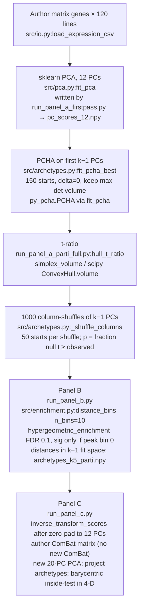

# ParTI / PCHA implementation in this repository

Read-only technical reference: how **this codebase** runs Groves-style Figure 1A–C (Pareto Task Inference via PCHA), how that compares to the authors’ MATLAB ParTI clone in `reference/`, and where breast / GBM / SCLC tracks diverge.

**Companion docs:** [`PROJECT_CONTEXT.md`](../PROJECT_CONTEXT.md) (navigation and caveats), [`AUDIT_REPORT.md`](AUDIT_REPORT.md) (cross-cancer audit), [`SCLC Reproduction - Groves Cell Systems 2022/docs/02_how_we_implemented_this.md`](../SCLC%20Reproduction%20-%20Groves%20Cell%20Systems%202022/docs/02_how_we_implemented_this.md) (SCLC reproduction narrative).

**Ground truth checked locally:** `reference/` is present (gitignored clone of [QuLab-VU/Groves-CellSys2022](https://github.com/QuLab-VU/Groves-CellSys2022)). Published SCLC numbers appear in `reference/notebooks/ParTI-code/human-cell-lines/params_lognorm.txt` (e.g. k=5, t-ratio ≈ 0.107, p ≈ 0.034).

**Do not silently rerun** 500×50 PCHA permutations unless you intend to; see PROJECT_CONTEXT §9.

---

## 1. Official SCLC pipeline (trace)

**Drivers (scientific):** `SCLC Reproduction - Groves Cell Systems 2022/codes/run_panel_a_parti_full.py`, `run_panel_b.py`, `run_panel_c.py`, `export_sclc_reproduction_figures.py`.

**Not official:** `run_panel_a_firstpass.py`, `run_panel_a_permutation.py` (12-D fit, `delta=0.1`, single-start permutations).

### Per-stage detail (SCLC parameters)

| Stage | File : function | What it computes | SCLC parameters |
|--------|-----------------|------------------|-----------------|
| Load | `src/io.py:load_expression_csv` | Genes × samples CSV; prefers `SCLC/data/`, else `reference/data/...` | Pre-log, pre–CCLE/Minna ComBat matrix; not rebuilt |
| PCA | `src/pca.py:fit_pca` | Full SVD, samples × genes → scores | `n_components=12` in firstpass; matches Groves `dim=12` in `params_lognorm.txt` |
| One PCHA start | `src/archetypes.py:fit_pcha` | `py_pcha.PCHA`; returns archetypes, mixture weights `S`, ESV | `delta=0`, `conv_crit=1e-6`, `maxiter=500`, up to 25 init retries |
| Multi-start fit | `fit_pcha_best` | Slice `[:, :k-1]`; keep simplex with largest `simplex_volume` | Observed: `n_init=150`; each null shuffle: `n_init=50` |
| Simplex volume | `simplex_volume` | `\|det(arcs[:,:-1] - arcs[:, -1])\| / (k-1)!` | Same as `reference/ParTI/findMinSimplex.m` (PCHA branch) |
| t-ratio | `hull_t_ratio` in driver | `simplex_volume(archetypes) / ConvexHull(data[:,:k-1]).volume` | **Not** `src/archetypes.t_ratio` (that uses ConvexHull for both) |
| Null | `_shuffle_columns` | Independent permutation of each PC across samples | `N_PERM=1000`; RNG `default_rng([SEED, k, i])` per shuffle |
| p-value | `permute_one_k` | `mean(finite null >= observed)` | Failures dropped from denominator; MATLAB uses strict `>` and fixed `maxRuns` |
| Panel B | `distance_bins`, `hypergeometric_enrichment` | Equal-count Euclidean bins; hypergeom + BH; hit = `sig_peak_at_bin0` | `n_bins=10`, `fdr=0.1`; scores `[:, :4]` for k=5; labels `NEW_10_2020` |
| Panel C | `run_panel_c.py` | Pad 4-D vertices to 12-D → gene space → new PCA on author combined matrix; barycentric weights | `K=5` hardcoded; ComBat from `load_combined_combat`; no PCHA on tumors |

`run_panel_a_parti_full.py` does **not** refit PCA; it loads `results/panel_a/pc_scores_12.npy`.

---

## 2. Original ParTI / Groves (MATLAB + paper)

### PCHA calling convention

From `reference/ParTI/findMinSimplex.m` (case 5, PCHA):

- Fit on `DataPCA(:, 1:min(k-1, DataDim))` — a **k-simplex is (k−1)-dimensional**.
- `delta = 0` (vertices as convex combinations of samples).
- **Observed simplex:** loop `3 * numIter` times; keep **`max(VolArch)`** (largest determinant volume, not smallest residual).
- **Null (shuffle):** `CalculateSimplexTratiosPCHA.m` — per shuffle, permute each PC column; run `numIter` PCHA fits; keep **`max(RandDataRatios)`** per shuffle.
- **t-ratio:** `VolArchReal / ConvexHull(data in k−1 D)` (`findArchetypes.m`).
- **p-value (PCHA):** `sum(tRatioRand > tRatioReal) / maxRuns` (strict inequality).

`reference/ParTI/ParTI.m` defaults: `maxRuns=1000`, `numIter=50`, but for `algNum==5` it sets **`numIter=5`** (so **15** observed and **5** null inits per shuffle in a vanilla ParTI.m run). Groves’ saved `params_lognorm.txt` t-ratios match the **paper-scale** search (this repo’s SCLC/GBM use 150/50, documented as matching Groves reproduction, not the `numIter=5` override in ParTI.m).

### Choosing k

`findArchetypes.m`:

1. ESV curve via PCHA for k = 2 … dim.
2. `DimensionFinder(TotESV1) + 1` as elbow suggestion (`reference/ParTI/DimensionFinder.m` — max distance from chord).
3. User input or `ForceNArchetypes` in workspace (Groves notebooks set this).
4. Smallest k with significant t-ratio is the **scientific** Groves choice for SCLC (k=5); this repo’s breast/GBM drivers implement: smallest k with **p < 0.05**, else DimensionFinder (`Glioblastoma/codes/run_panelA.py`, breast `run_panelA*.py`).

### Panel B (original)

- `calculateEnrichment.m` → `sortDataByDistance.m`: Euclidean distance in the PC space passed in (Groves `binSize=0.1` → 10 bins).
- Discrete features: hypergeometric-style enrichment; this repo’s `hypergeometric_enrichment` is a simplified port (BH FDR, bin-0 peak rule).

### Panel C (original)

- Second ComBat: cell line vs tumor, `mod = ~1`, **`ref.batch` = cell line** (Groves Rmd; breast/GBM use `combat_cellline_tumor.R` + `sva`).
- Archetypes mapped to gene space, merged matrix, **new PCA** on combined data.
- **Do not refit PCHA** on tumors; project fixed vertices.

SCLC Panel C uses the **authors’ pre-ComBat** combined matrix (`CCLE_Minna_Thomas_COMBAT.csv`). Breast/GBM Panel C run ComBat locally (R `sva` preferred, `src/combat.py` fallback).

---

## 3. Deviation table (this repo vs original)

| Stage | This repo | Original (ParTI / Groves) | Match? | Intentional? |
|--------|-----------|---------------------------|--------|----------------|
| Fit dimension | First **k−1** PCs for PCHA / t-ratio | Same in `findMinSimplex` / `CalculateSimplexTratiosPCHA` | Yes | Yes |
| `delta` | `0.0` in official drivers | `0` in PCHA branch | Yes | Yes |
| Observed inits | SCLC, GBM: **150**; breast Panel A: **15** (`NUM_ITER=5`) | Paper narrative: 3×50; ParTI.m PCHA override: 3×5 | SCLC/GBM match paper scale; breast matches ParTI.m override | Documented speed tradeoff (breast) |
| Null inits / shuffle | SCLC: 50 × **1000**; breast/GBM: 5 × **500** or 50 × **500** | `numIter` × `maxRuns=1000` | SCLC shuffles match; breast/GBM fewer shuffles | Documented; **p-values not comparable across cancers** |
| Volume formula | Determinant simplex / data convex hull | Same | Yes (official path) | Yes |
| p-value | `>=`, drop failed shuffles | `>`, fixed denominator `maxRuns` | Small deviation | Incidental |
| k selection | Disease-specific `suggested_k.txt`; SCLC **fixes k=5** for B/C | ForceNArchetypes + t-table | Rule aligned; SCLC fixed by design | Yes |
| Panel B space | SCLC/breast/GBM B: **first k−1 PCs** for distances (current `run_panel_b.py`) | PC columns aligned to archetype dimension | Yes (current code) | — |
| Panel C ComBat | SCLC: precomputed; breast/GBM: R `sva` or Python | Groves `ComBat` + ref batch | Yes when R used | Yes |
| Hardcoded k in Panel C | SCLC `K=5`; breast **default** `run_panelC_tcga.py` → `archetypes_k4_parti.npy` | Should follow Panel A choice | GBM reads `suggested_k.txt`; breast default TCGA track **still hardcodes k=4** | Breast TCGA: **drift risk** (KS/METABRIC C scripts use `suggested_k.txt`) |

**Apples-to-oranges risk:** Do not compare raw p-values across SCLC (1000 shuffles, 150/50 inits), GBM (500, 150/50), and breast (500, 15/5). Compare **t-ratios** on the same protocol, or rerun with unified `N_PERM` and `NUM_ITER`.

---

## 4. Conceptual primer (what the code is optimizing)

**PCHA** finds k archetypes such that each sample is a **convex combination** (nonnegative weights summing to 1) of those vertices. With `delta=0`, vertices lie in the convex hull of the data.

**Why k−1 PCs:** A non-degenerate k-vertex simplex spans a (k−1)-dimensional affine subspace. Fitting in 12 PCs and then using k=5 for display still means the **significance test** and Panel B distances for Groves use **4** dimensions.

**t-ratio:** Ratio of simplex volume to convex hull volume in that (k−1)-D subspace. Structured “corner” data → small simplex relative to hull → low t → extreme vs column-shuffled nulls.

**Max-volume multi-start:** Both observed and null fits take the **best of many random inits** (max volume / max ratio). Observed gets `3×numIter` tries; each null shuffle gets `numIter`. That raises observed t relative to typical nulls; it is ParTI’s rule, not an unbiased estimator of a single “true” simplex.

**Panel C geometry:** Tumors are asked whether they fall **inside** the cell-line simplex after batch correction and a **new** PCA. Variance-explained plots are descriptive; **containment** (barycentric weights ≥ 0) is the Groves-style generalization test.

**Legacy helpers:** `src/archetypes.permutation_t_ratio` and `t_ratio` use `delta=0.1` defaults and a single `fit_pcha` per shuffle — first-pass only. Official tracks use `fit_pcha_best` + driver-specific `hull_t_ratio`.

---

## 5. Shared engine (`src/`)

| Module | Role |
|--------|------|
| `archetypes.py` | `fit_pcha`, `fit_pcha_best`, `simplex_volume`, `esv_curve`, `_shuffle_columns`, legacy `permutation_t_ratio` |
| `pca.py` | `fit_pca`, `cumulative_variance`, `align_pca_signs`, `inverse_transform_scores` |
| `enrichment.py` | `distance_bins`, `hypergeometric_enrichment` (+ SCLC-only clustering helpers) |
| `combat.py` | Parametric ComBat fallback (`mod=~1`, `ref_batch`) |
| `io.py` | SCLC matrix paths |
| `preprocess.py` | DepMap breast/GBM line selection and gene filtering |

Disease scripts: `sys.path.insert(0, repo_root)` then `from src....`.

---

## 6. Alternatives and tradeoffs

| Change | Benefit | Cost |
|--------|---------|------|
| Equal inits for observed vs null (e.g. 50/50) | Fairer p-value | Deviates from ParTI 3× rule; may shift t-ratios vs published Groves |
| Report median volume across inits, not max | Less optimistic bias | No longer matches Groves/ParTI definition |
| Seed every `py_pcha` start explicitly | Reproducible parallel multi-start | Requires threading `numpy` RNG into `fit_pcha` / workers |
| Parallelize inits inside one k (not only across k) | Faster Panel A | Must set `OMP_NUM_THREADS=1` per worker; unseeded PCHA → run-to-run jitter |
| Unify `N_PERM` and `NUM_ITER` across cancers | Comparable p-values | Long runtimes (1000 × 50 × k) |
| Breast `run_panelC_tcga.py` read `suggested_k.txt` | B/C/A same k | One-line path fix + regenerate C |
| Test `src/combat.py` vs `sva::ComBat` on one matrix | Know when fallback is safe | No test exists today; fallback may be rarely exercised |

---

## 7. Open questions / not verified here

1. **Which `numIter` Groves actually used** when writing `params_lognorm.txt` — local `ParTI.m` would imply 5, reproduction docs imply 50.
2. **Numerical identity** of Python ComBat vs R `sva` on identical inputs (no automated test in repo).
3. **Exact PC column layout** passed to ParTI enrichment vs this repo’s `distance_bins` (bin count and Euclidean definition align; full transpose/orientation not proven line-by-line).
4. **Whether `esv_curve`** should use `delta=0` and multi-start for parity with Panel A (currently single `fit_pcha` with default `delta=0.1` in function signature — breast/GBM pass `DELTA=0.0` from drivers for ESV in those scripts).

---

## 8. Quick file index (SCLC official)

| Artifact | Path |
|----------|------|
| PCA scores | `SCLC .../results/panel_a/pc_scores_12.npy` |
| Archetypes | `archetypes_k{k}_parti.npy`, `S_k{k}_parti.npy` |
| Nulls | `null_t_ratios_k{k}_parti_n1000.npy` |
| t-table | `t_ratio_parti_1000.csv`, `t_ratio_official.csv` |
| Panel B | `results/panel_b/enrichment_*.csv` |
| Panel C | `results/panel_c/containment_summary.csv`, `variance_explained.csv` |

---

*Document generated from codebase read-through (2026-09). Update when drivers or `reference/` ParTI defaults change.*
